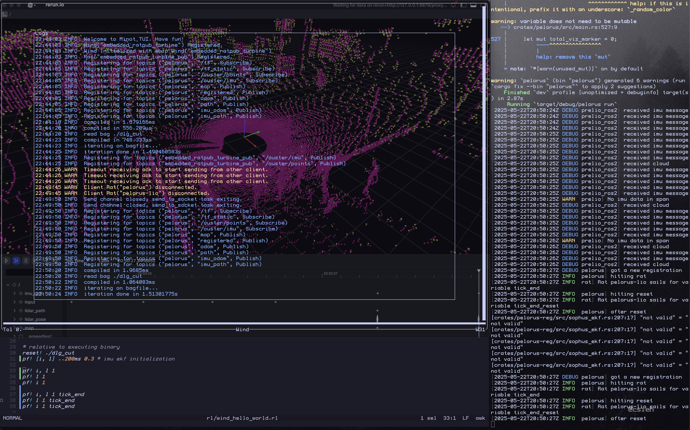

# Introduction

**Minot** [mai·not] provides primitives for developing and verifying robot software with in a single executable binary.

Its main features are built around Bagfiles from ROS2 that use MCAP for storage.

All the provided features are meant to be used at development time to give you full control over the incoming data. It gives you transparency for complex systems where thousands of small sensor data packets are processed each second. With Minot, you regain control and explainability over what's happening when developing and integrating your Robot.

## First Look

The following example gives you a general idea of what Minot can do.

{ width="1000" loading="lazy" }
/// caption
Click the image to explore it in more detail.
!!! note
        
    This example just showcases just a selection of Minot's features, but it demonstrates a pipeline I've found particularly helpful and, I believe, will benefit others.
///

You are looking at a bugged Lidar Inertial Odometry (LIO) ROS2 node. For IMU initialisation, only the necessary frames are played from a Bagfile to the node. 

We synchronise the Bagfile with our node using a unique approach: an empty variable in the LIO acts as a trigger for publishing a new batch of messages. This triggers the registration part in the LIO, which then triggers the variable again, creating an endless loop. Thanks to Minot's locking feature, the process doesn't need to run until the end of the Bagfile; we can press comma (`,`) on the keyboard to advance to the next registration, or stop it entirely to compare and visualize the state using debuggers, visualizers, or [logging to the TUI](./tui.md#variable-sharing-log-and-compare).

*Notably, everything is running natively on a Macbook with no containers or ROS installation.*

**How?**

Minot is a collection of binaries and libraries. They can be used in your existing ROS1 or ROS2 nodes or completely separate from any system. This allows cross-ROS communication using its own networking layer without adding dependencies. With Minot, you can also write, test and debug ROS perception nodes without needing ROS on your system (currently Rust-only). This is especially useful for testing, where determinism is essential. When you are done, just comment out a few lines or change a compile flag and you are ready to run your node in ROS.

There are 3 features. They can be used standalone but when combined, they enable superpowers.

## Bagfile Querying

With ROS you can record and play everything published to the ROS network. This enables reproducability for nodes and greatly improves the safety of developing real robots. Bagfiles are great! But the ROS tooling for playing the Bagfile is limited. It's still enough for most use cases but there are times where you need complete control over the data that is published to your subscribers. Minot packages a (kind of) query language for fine grained filtering and cursor control inside your Bagfile for fast iterations. This is Bagfile Querying in Minot.

It introduces a small, embedded language and functions for maximal control over your node while keeping flexibility. For more information, visit the [feature page](bagquery.md).

### Quickstart

~~~ bash title="Setup"
sudo apt install curl unzip

mkdir minot-bagfile-demo && cd minot-bagfile-demo
source /opt/ros/jazzy/setup.bash 2>/dev/null || source /opt/ros/humble/setup.bash

# Get Minot with ROS2 publisher
curl -sSf https://raw.githubusercontent.com/uos/minot/main/install.sh | sh --ros-distro $ROS_DISTRO

# Get a Bagfile saved with mcap storage
curl -Lo dlg_cut.zip "https://myshare.uni-osnabrueck.de/f/5faf4154af384854ab94?dl=1" \
    && unzip dlg_cut.zip \
    && rm dlg_cut.zip

# Get the query
curl -Lo demo.mt "https://uos.github.io/minot/assets/demo_publish.mt"

# Get the rviz demo preset
curl -Lo demo.rviz "https://uos.github.io/minot/assets/demo_publish.rviz"

# Run rviz and wait for data
rviz2 -d demo.rviz
~~~

Open a new terminal.
~~~ bash title="Run Minot TUI"
source /opt/ros/$ROS_DISTRO/setup.bash

# Run
minot tui demo.mt

# Press Space
# You should see a 3D Pointcloud in rviz2 now.
# Press j until you see "W3" in the bottom right.
# Press Space again to evaluate line 3 of demo.mt and repeat how often you like.
# Quit Minot with q

# Clean up everything we created
cd .. && rm -rf minot-bagfile-demo && minot uninstall
~~~

## Variable Sharing

One of the main tasks of the ROS Pub/Sub system (excluding non-sensor pipelines with actions and service) is sharing a new value of something. At development time, when accuracy is at the highest priority, this async model might be in your way.

With *librat*, you can share variables synchronously over the network. The library is written in Rust but targeted at C. It's built for the absolute minimal user footprint. You initialise it once and then give it any variables to cling to without changing anything else in your existing code. Just look at the [header file](https://github.com/uos/minot/blob/main/rat/rat.h). You then explain the routes to the Minot TUI with intuitive syntax.

Variable sharing is a powerful building block and it can easily be used outside of the ROS context. Click [here](varshare.md) to learn more.

!!! tip "From Comparing to full E2E Testing"

    By just writing a "proc1 == proc2", and adding 4 lines of code in total, you can check the equality of a variable from two different processes (proc1, proc2) that don't need to share the language or system. Comparing is just syncing both variables with the TUI.

    This also effectively describes a unit test over the network. And together with using checkpoints as trigger for a Bagfile publish, Minot effectively gives you an entire E2E testing framework for ROS networks.

### Quickstart

Build and run the libraries and run the Coordinator.

~~~bash
git clone https://github.com/uos/minot && cd minot
cargo build

./target/debug/minot-coord mt/varshare_demo.mt
~~~

Start a second terminal to run rat1 in Rust.
~~~bash
cargo run --example rat1
~~~

Start a third terminal to build and run rat2 in C.

~~~bash
gcc rat/examples/rat2.c -o rat2 -L./target/release -l:librat.a -lm -Wl,-z,noexecstack

./rat2

# rat1 and rat2 terminate successfully.
# Look at the source code of the C file you just compiled.
# rat1 just flipped the 0 from rat2 to 1.

# Clean up
cd .. && rm -rf minot
~~~

## Native Publish/Subscribe

The Pub/Sub model has proven itself among ROS developers. It's an intuitive way to exchange time series data. But sometimes adding the entire ROS stack with all its solutions for problems outside of the domain of the problem your node tries to solve seems like overkill.

For these cases, the native publisher and subscriber Rust library *ratpub* can help. By building on the same concepts as Variable Sharing, it removes ROS from the dependency list at development time if you only use that API from ROS. Read more about it [here](pubsub.md).

~~~bash title="Quickstart"
# Clone the example nodes
git clone https://github.com/stelzo/ratpub-demo && cd ratpub-demo

# Install the Coordinator
curl -sSf https://raw.githubusercontent.com/uos/minot/main/install.sh | sh

# Run it
minot-coord
~~~

Start a second terminal to run the a node.
~~~bash
cargo run --bin node1
~~~

Start a third terminal another one.
~~~bash
cargo run --bin node2
~~~

Exit everything with Ctrl+C. Then cleanup everything we created: `cd .. && rm -r ratpub-demo && minot uninstall`.

Find out how this nodes works and how to write them [here](./pubsub.md).

!!! question "The Pain Leading to Minot"

    === "Message Timing"

        Does your system behave different each time you play a Bagfile until you find out it actually works when playing it a little bit slower?

    === "Ignore Networking"

        Have you ever asked yourself why you should care about QoS settings, out-of-order message pipelines or the dependency of ROS2 itself when developing a Proof of Concept?

    === "Reproducability"

        Have you ever developed a ROS Node with state that unexpectedly changes for some reason and now you try to reproduce it?
