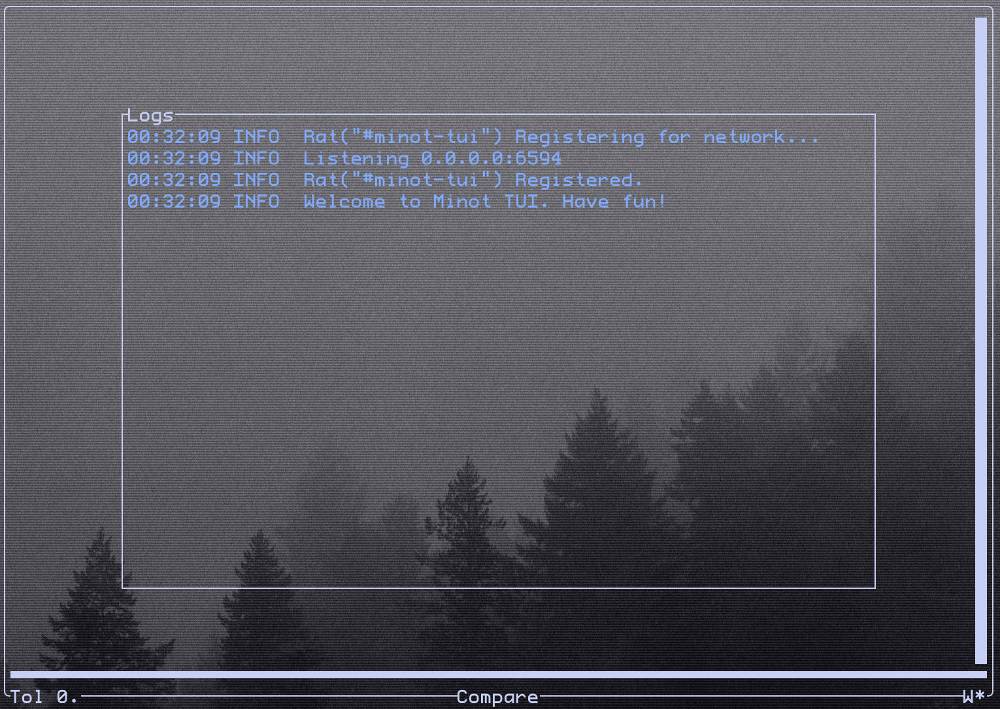
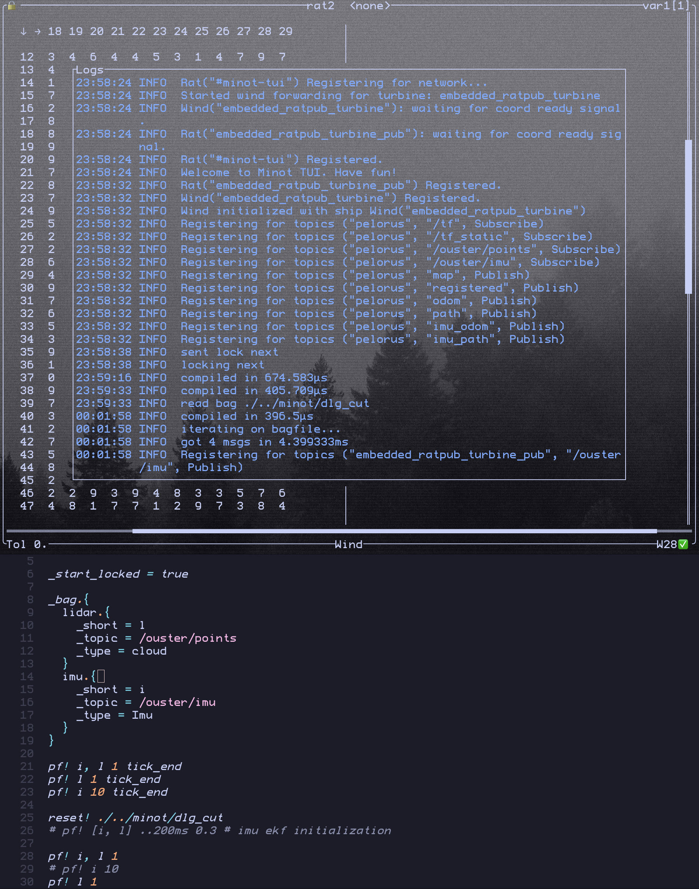
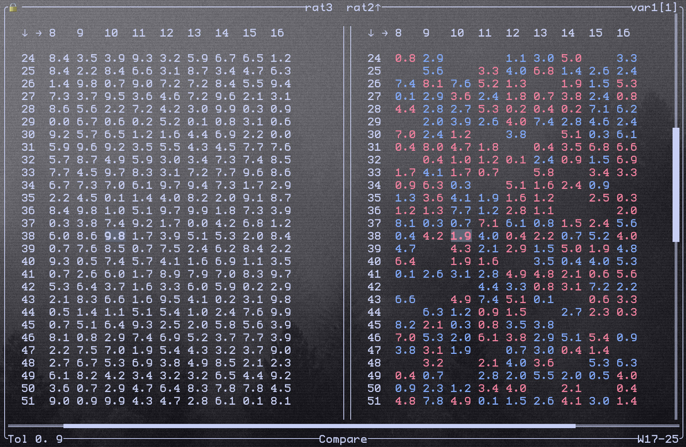

TUI stands for Terminal User Interface. In Minot, it functions as a dashboard with commands for controlling the features. It's the primary way you interact with Minot.

After [installing the binary with your chosen embeddings](installation.md#minot-tui), you can run the TUI with:
~~~bash
minot [<Path>]
~~~

The Path is optional. It defines the Ratslang file for [Bagfile Querying](bagquery.md) and [Variable Sharing](varshare.md#minot-tui-with-embedded-coordinator).

On startup, Minot searches for a Coordinator. If you embedded one in the binary (the default setting), it will be found immediately, and the following interface will appear.

{ width="500" }
/// caption
The freshly opened TUI with embedded Coordinator.
///

??? info "Background Image"

    The fonts, logos, and image in the background reflect my personal desktop setup as seen through my transparent terminal.

The first thing you'll see is the *Logs* window, which displays feedback from all background processes. You can adjust the output detail using the _log_level variable in the Ratslang file. Valid settings are `error`, `warn`, `info` (default), and `debug`.

You can toggle the Logs window with <kbd>?</kbd> or quit Minot with <kbd>q</kbd>. For all keybindings, see [here](./keybindings.md).

## Bagfile Query

At the bottom of the UI, you'll find the *Compare* indicator, which shows the current mode: *Compare* or *Wind*. Refer to the keybindings page for how to *Switch Mode*. From this point onward, specific key presses or actions won't be explicitly mentioned.

With Wind mode activated, you can move the Wind Cursor in the bottom right corner using Vim-like motions. Consider this a selection of lines from the file specified when launching the binary from the terminal. You can also select multiple lines simultaneously using *Select Mode*. It will change to a [W], and you can use the same motions to expand the selection. By default, it selects all lines with `*`.

At this point, it should become obvious that you'll need the Ratsfile open at the same time since you have no feedback like contents of the file. The file can also be modified, but be sure to save changes before returning to the TUI. You can then evaluate the selected lines.

Ratsfile evaluation is stateful. If you select a large variable definition part, the variable state will be cached by the TUI for all following evaluations. This allows you to subsequently select only the lines needed for execution, even if they depend on previous context.

!!! warning

    The Wind Cursor is a simple file cursor and doesn't understand Ratslang's structure. Consequently, you could evaluate a variable definition within a namespace block, but if the namespace boundaries aren’t included in the selection, the variable will be saved without the namespace.

After evaluation, new log messages will appear (at least with _log_level = info), providing feedback on your commands.

{ width="500" }
/// caption
Logs while using the Bagfile Query feature (top) along with the Ratsfile code (bottom). The bottom right of the Minot TUI indicates that line 28 was successfully evaluated, playing `/ouster/imu` until a message was found from `/ouster/points`. The logs also show that an embedded Ratpub publisher was used to distribute the message over a network.
///

## Variable Sharing (LOG and Compare)

Most of the screen in Minot TUI is dedicated to matrix logging and comparison.  All matrices sent to LOG are displayed here.  You can review the history of received matrices or compare matrices from different Rats that share the same variable.

You can move the cursor and observe the differences between each index of the right matrix (the comparison matrix) and a reference matrix on the left. You can swap the reference and comparison matrices and switch to different Rats with the same variable name.

Comparisons account for a tolerance for fuzzy matching. The bottom left corner displays the current tolerance as a floating-point number.

The final UI element is the lock indicator in the top left. Locking a variable causes the Rat to block the function until the TUI sends an unlock. This provides greater control over execution and enables advanced debugging. Combined with Bagfile Querying and variable triggers, you can create a step-by-step debugging experience by unlocking variables sequentially.

By default, variables are not locked. You can overwrite this by setting `_start_locked = true` in your Ratsfile.

{ width="500" }
/// caption
The difference between floating matrices sent from two different Rats in the network. The tolerance is set to 0.9, and the right side shows the differences compared to the left. Red values indicate a lower value, with the absolute difference displayed inside the cell. Blue cells represent higher values than the reference, also with the absolute difference in the cell. The cursor is currently positioned on row 38, column 10.
///
